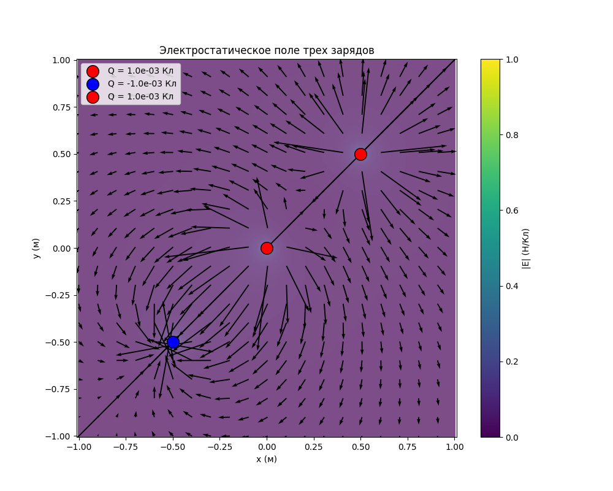

# Задание к лекции №10
>Моделирование. Визуализация электростатического поля системы неподвижных
точечных зарядов в двумерном пространстве. 
## Описание

Данная программа моделирует электростатическое поле, создаваемое системой неподвижных точечных зарядов в двумерном пространстве. Программа отображает поля, создаваемые каждым зарядом, а также их суперпозицию. Визуализация включает как псевдоцветную карту величины электрического поля, так и векторное поле, показывающее направление и интенсивность электрического поля.

## Теоретические материалы

### 1. Закон Кулона

Электрическое поле  $\vec{E}$, создаваемое точечным зарядом $q$ в точке с координатами $(x, y)$, определяется законом Кулона:

$\vec{E} = \frac{k \cdot q}{r^2} \hat{r}$

где:
- $k = 8.99 \times 10^9$, $\text{Н·м}^2/\text{Кл}^2$ — электрическая постоянная,
- $q$ — заряд (в кулонах),
- $r$ — расстояние от заряда до точки наблюдения (в метрах),
- $\hat{r}$ — единичный вектор, указывающий направление от заряда к точке наблюдения.

Электрическое поле от одного заряда можно разделить на компоненты по осям $x$ и $y$:

$E_x = \frac{k \cdot q \cdot (x - x_i)}{r^3}, \quad E_y = \frac{k \cdot q \cdot (y - y_i)}{r^3}$

где $(x_i, y_i)$ — координаты заряда.

### 2. Принцип суперпозиции

Если в пространстве находятся несколько зарядов, то результирующее поле $\vec{E}_{\text{total}}$ в любой точке является суммой полей, создаваемых каждым зарядом:

$\vec{E}_{\text{total}} = \sum_{i=1}^N \vec{E}_i$

где $\vec{E}_i$ — поле, создаваемое $i$-м зарядом. Это правило называется **принципом суперпозиции**.

### 3. Визуализация

Для визуализации поля в программе используется два основных подхода:
- **Псевдоцветная карта**: отображает величину электрического поля $|\vec{E}|$, где $|\vec{E}| = \sqrt{E_x^2 + E_y^2}$. Цветовая карта отображает интенсивность поля в каждой точке пространства.
- **Векторное поле**: показывает направление и величину электрического поля в каждой точке.

Векторное поле отображается с помощью стрелок, где каждая стрелка указывает направление поля и пропорциональна его величине.

### 4. Ограничения модели

- **Точечные заряды**: Заряды предполагаются точечными, то есть имеют нулевые размеры. В реальности заряды могут иметь распределение.
- **Двумерное пространство**: Все расчеты и визуализация происходят в двумерном пространстве. Третий измерение не учитывается.
- **Отсутствие экранных эффектов**: Взаимодействие между зарядами и эффект экранирования не учитываются.

## Работа программы

Программа моделирует электрическое поле для заданной системы точечных зарядов и отображает его на графике. Для этого выполняются следующие шаги:

1. Определяются параметры зарядов (координаты и величины).
2. Строится сетка на плоскости для вычисления поля в каждой точке.
3. Для каждого заряда вычисляется его вклад в электрическое поле в каждой точке сетки с использованием формул из закона Кулона.
4. Все поля суперпозиционно складываются, создавая результирующее поле.
5. Поле визуализируется с помощью псевдоцветной карты и векторного поля.

## Пример
